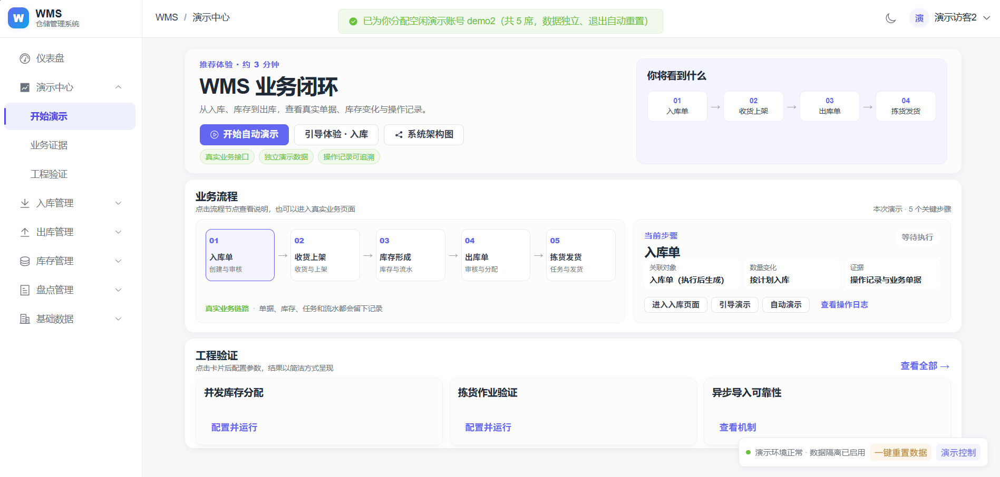
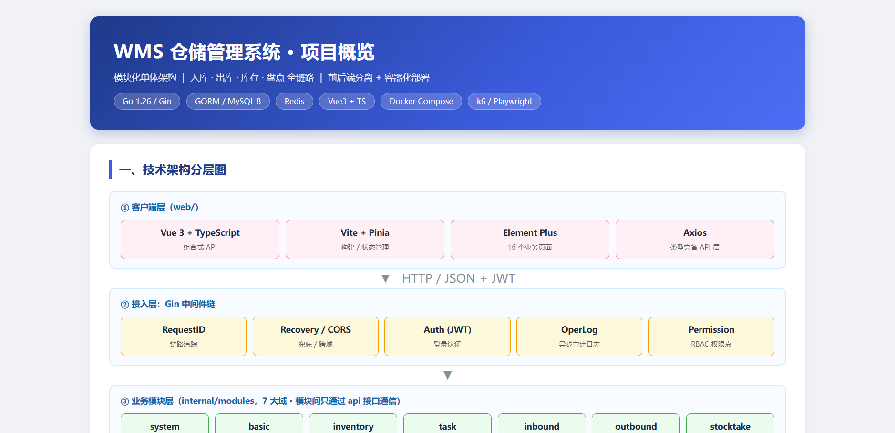

# WMS 仓储管理系统

[](https://github.com/mengw-dev/go-wms/actions/workflows/ci.yml)
[](LICENSE)
[](https://go.dev/)
[](https://vuejs.org/)

WMS 是一个前后端分离的轻量级 WMS，覆盖仓库、库位、货品、入库、库存、出库、盘点、任务和系统管理。项目重点处理库存并发、FIFO 分配、单据状态机、库存流水和异步 Excel 导入。

> 适合作为 Go + Vue 全栈学习项目、毕业设计或中小型仓储系统二次开发基础。部署前请阅读 [部署指南](docs/deployment.md) 与 [运行边界](docs/production-readiness.md)。

**公网地址**：<https://mengw21.cn> （演示使用说明见 [演示指南](docs/demo.md)）

**在线架构图**：<https://mengw21.cn/overview.html>

## 界面预览

支持浅色与深色两套主题。演示中心可执行入库、上架、出库和拣货闭环，并查看单据、任务及库存流水。



<details>
<summary>查看架构全景图</summary>

[](https://mengw21.cn/overview.html)

</details>

## 核心能力

- **库存一致性**：三数量模型 `stock = available + allocated`，事务、行锁、数量条件更新与数据库 CHECK 约束。
- **FIFO 分配**：按首次上架时间和 ID 查询候选，锁定满足需求的库存行，在事务内分配并生成拣货任务。
- **业务闭环**：入库、收货、上架、出库、拣货、盘点与可追溯库存流水。
- **异步导入**：数据库任务队列、执行标识校验、心跳与补偿，按导入任务及行号去重。
- **拣货与领取幂等**：同键重试回放首次成功结果；PDA 入口强制操作键与相应扫码校验，幂等记录保留 7 天。
- **身份与权限**：JWT、Token 版本校验、RBAC、多租户隔离与独立演示账号。
- **工程验证**：MySQL 集成测试、并发回归、Playwright E2E、k6 场景、CI 和容器部署。

## 技术栈

| 层次 | 技术 |
| --- | --- |
| 后端 | Go 1.26、Gin、GORM、MySQL 8.0.16+、Redis 7 |
| 前端 | Vue 3、TypeScript、Vite 8、Element Plus、Pinia |
| 验证 | Go test / race、golangci-lint、Vitest、Playwright、k6 |
| 部署与监控 | Docker Compose、Nginx、Caddy、Prometheus、Grafana |

Redis 不可用时部分能力降级；演示会话依赖 Redis，不能将其视为所有功能都可选的依赖。

## 快速开始

### Windows + Docker

安装并启动 Docker Desktop，在仓库根目录双击 `start.cmd`，或执行：

```powershell
.\scripts\windows\start.ps1
```

脚本生成本地配置和随机密码，构建并启动服务。默认访问 `http://127.0.0.1`，管理员用户名为 `admin`，初始密码由脚本输出并保存在本地 `.env`。

停止服务使用 `.\scripts\windows\stop.ps1`，保留数据卷。手动 Docker、端口修改、升级与 HTTPS 见 [部署指南](docs/deployment.md)。

### 本机开发

准备 Go、Node.js、MySQL 和 Redis 后，按 [本地开发指南](docs/development.md) 启动后端与 Vite。默认 API 为 `http://127.0.0.1:8080`，前端为 `http://127.0.0.1:5173`。

## 验证

Windows 全量检查入口：

```powershell
.\scripts\windows\verify.ps1
# 可选：-WithRace、-WithE2E
```

日常检查：

```bash
go vet ./...
go test ./...
npm --prefix web run lint
npm --prefix web test
npm --prefix web run build
```

数据库与 Redis 不可用时部分集成测试默认跳过；完整验证需要专用测试依赖和 `WMS_TEST_REQUIRED=1`。测试配置、隔离 E2E 与压测说明见 [开发指南](docs/development.md) 和 [压测指南](docs/load-testing.md)。

## 项目结构

```text
cmd/                  应用入口、迁移与初始化命令
internal/app/         依赖组装与路由
internal/bootstrap/   启动初始化
internal/modules/     仓储业务、系统管理、Demo 与 AI
internal/pkg/         事务、租户、锁、幂等、配置等基础能力
internal/testutil/    隔离测试依赖
migrations/           版本化迁移与回归测试
web/                  Vue 前端与前端测试
deploy/               容器、HTTPS 与监控配置
scripts/              验证、启动、打包与压测脚本
samples/              Excel 和外部系统对接样例
docs/                 使用、设计和维护文档
```

## 文档导航

| 目标 | 文档 |
| --- | --- |
| 启动与验证 | [本地开发](docs/development.md) · [部署升级](docs/deployment.md) · [配置参考](docs/configuration.md) |
| 理解业务 | [需求与边界](docs/requirements.md) · [演示指南](docs/demo.md) · [示例数据](samples/README.md) |
| 阅读实现 | [架构](docs/architecture.md) · [数据库](docs/database.md) · [API](docs/api.md) |
| 维护项目 | [Go 约定](docs/go-style.md) · [代码索引](docs/code-index.md) |
| 运行与评估 | [监控](docs/monitoring.md) · [压测](docs/load-testing.md) · [生产就绪评估](docs/production-readiness.md) |

完整分类见 [文档目录](docs/README.md)。

## 已知边界

- 请求级幂等已覆盖后端拣货和任务领取；收货、上架和盘点审核尚未统一接入。PDA 前端仍需完善跨刷新恢复及连续分次拣货的操作键生命周期。
- 外部出库单按业务单号去重，尚未校验同号请求内容是否一致。
- 盘点未冻结现场作业，审核以锁内当前库存和实盘数调整。
- 导入文件使用本地存储，多实例需要共享文件；登录限流和部分缓存仍为进程内状态。
- 备份恢复、告警和滚动升级等运维能力仍待完善，详见 [运行边界](docs/production-readiness.md)。

## License

[MIT](LICENSE)
