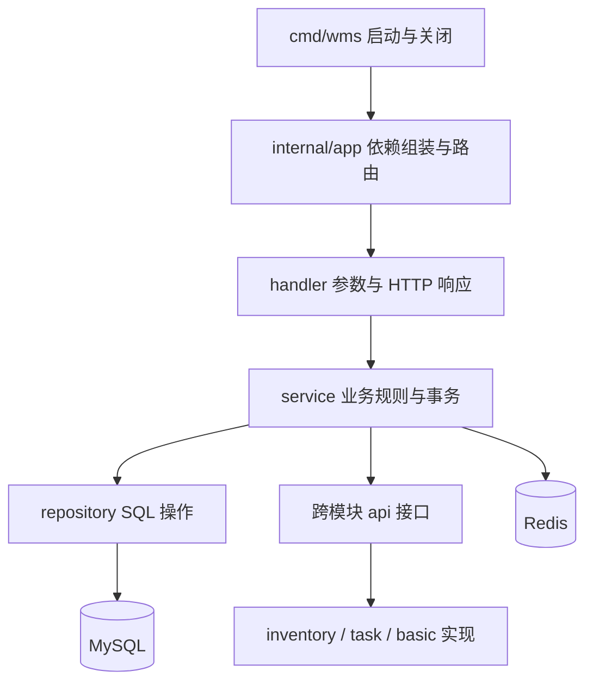
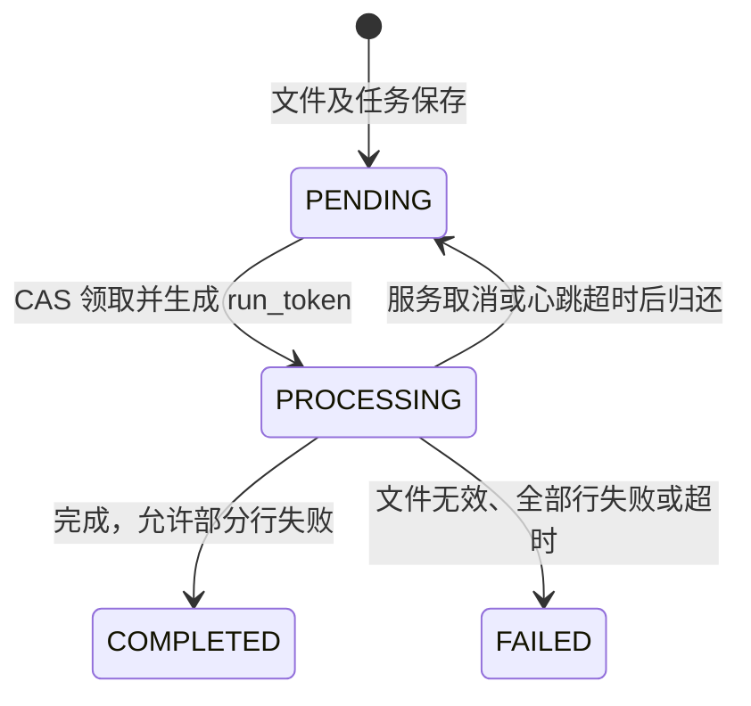

# WMS 架构与代码阅读说明

这份文档描述当前实现，配合 `docs/go-style.md` 阅读。目录是一种组织方式，不是所有 Go 项目都必须采用的模板。

## 1. 保留模块化单体

后端使用 Gin、GORM、MySQL 和 Redis，通过普通构造函数组装依赖。业务模块包括 system、basic、inventory、task、inbound、outbound、stocktake，以及演示与 AI 辅助模块。

当前项目适合保留单体：入库、库存、任务、出库分配依赖同一笔 MySQL 事务。把接口换成 RPC 不会自动保留这项保证，拆微服务需要重新设计跨服务一致性，当前没有必要。



- `handler` 负责绑定参数、权限、身份和响应；业务规则仍需在 Service 入口维护，因为导入和演示场景也会直接调用 Service。
- `service` 决定库存相关事务的边界。事务内的 Repository 和跨模块 API 接收同一个 `*gorm.DB`，事务外查询传递请求 context。
- `repository` 提供具体查询和更新，不引入通用 CRUD 基类。system 目前在 Repository 内封装用户与角色关联事务，可以理解这项局部差异，不必为了目录整齐全部改写。
- `api` 是进程内 Go 接口，不是 HTTP 或 RPC 接口。已有接口可以保留，没有必要给每个具体类型再加一层接口。
- demo 作为场景编排模块直接依赖业务 Service；库存和盘点还有明确的跨表联查。因此“所有模块都只通过接口访问自己的表”不是当前代码的事实。

## 2. 库存规则和事务

库存行按 `(tenant_id, warehouse_id, location_id, sku_id, batch_no)` 唯一。正常业务需保持：

```text
stock_quantity = available_quantity + allocated_quantity
stock_quantity、available_quantity、allocated_quantity 均不小于零
```

| 操作 | 总库存 | 可用库存 | 已分配库存 |
| --- | --- | --- | --- |
| 上架 N | +N | +N | 不变 |
| 分配 N | 不变 | -N | +N |
| 释放 N | 不变 | +N | -N |
| 发货 N | -N | 不变 | -N |
| 盘点差异 D | +D | +D | 不变 |

业务 Service 开启事务，库存先锁读，再执行数量条件更新，并在同一事务写库存流水。分配流水的总量变化为零，但记录可用量减少。写流水失败时，调用方必须返回错误，使整笔事务回滚。

库存 `version` 会递增，但库存 SQL 没有 `WHERE version = ?`，不能把它介绍成“库存乐观锁”。真正使用版本比较的是单据进度、任务和分配等更新；状态转换还会使用期望状态条件。MySQL 的现有 CHECK 仅检查总量与可用量非负，不能代替完整不变量。

FIFO 按 `stock_in_time, id` 排序。`stock_in_time` 是这一库存四元组首次上架时间；后续补入同一批次会合并到同一行，系统没有逐次收货的独立 FIFO 层。分配后按库位编码排序只改变拣货任务顺序，不改变分配批次。

出库审核内的多个 SKU 按相同顺序加锁，有助于降低审核之间的死锁；与盘点、上架交错时仍可能死锁。`TxRetry` 在可重试错误后重开整笔事务，不能只重试事务中间的一条 SQL。

## 3. 单据流程

入库：草稿 → 提交 → 审核生成收货任务 → 收货 → 上架 → 完成。`qty` 和 `received_qty` 都表示包含不良品的总收货量，`defective_qty` 是其中的不良品；例如总量 10、不良品 2，对应收货进度 10、上架量 8。全是不良品时无上架任务，收齐直接完成。

出库：提交后审核，在一笔事务中完成 FIFO 分配、分配明细、拣货任务和单据状态推进。按分配行拣满时扣减该行库存，整单拣满后进入 SHIPPED。部分拣货后不允许取消，需要另外设计退货或反向业务，不能直接释放已发库存。

盘点：创建时保存账面快照，填写实盘数，审核时锁定库存并将总库存调整到实盘数。差异、实际调整和流水使用同一份锁读结果；不允许调减已分配库存。当前允许部分明细填写后审核，未填写明细跳过。盘点没有冻结仓库，实盘记录与后续作业的业务时间口径仍需要使用者理解，不能把行锁等同于完整的实物盘点流程。

## 4. 导入任务与生命周期

HTTP 上传保存文件和 PENDING 任务后返回。入口显式启动一个 `RunImports(ctx)` 消费者、一个补偿扫描器和操作日志消费者，关闭时取消并等待退出。



- 每次领取产生新的 `run_token`。心跳和终态写入必须属于本次执行，旧 worker 不能覆盖新 worker。
- 每行建单事务锁住任务行并确认执行权；`(tenant_id, import_task_id, import_row)` 唯一键用于重跑幂等。
- 每 30 秒心跳；单次执行期限 10 分钟；扫描器每 2 分钟回收心跳超过 5 分钟的任务，并在更新时再次检查时间和 token。
- 一实例一次处理一个文件，避免每次上传直接创建无上限 goroutine。多实例可以竞争数据库任务，但必须共享文件存储。
- 文件系统和 MySQL 没有共同事务。保存任务失败会清理本次文件，但崩溃仍可能留下孤立文件，文件保留和清理策略尚需完善。
- 解析限制解压后文件为 64 MiB。Excel 解析库不支持每一步都接收 context，取消在解析步骤之间生效，不能承诺任意大文件解析都立即停止。

## 5. 多租户、认证与 Redis

JWT 声明用户、租户和 Token 版本。签名、签发方、过期时间校验后，数据库再次复核用户状态、版本和租户。演示会话中间件在注册业务路由之前挂载，缺少会话的演示账号不能调用普通业务 API。

账号身份是“租户 + 用户名”。登录支持可选租户编号；为了兼容既有入口，省略时允许唯一用户名登录，重名则拒绝并要求指定租户，不能用 First 任意选一条。显式租户 0 精确匹配平台账号。登录后按账号实际租户加载角色权限；创建用户的重名检查也限定在目标租户。

登录限流在互斥锁内检查并预占次数，再执行数据库查询与密码校验，避免并发检查全部通过。记录容量与过期清理均有界，清理由请求触发，不新增后台 goroutine；具体窗口与容量见 `docs/api.md`。当前是进程内限制，多实例不能把它介绍为统一的防暴力破解方案。

演示身份依据已验证 JWT 的租户号，不依据用户名是否叫 demo1。会话领取与重置只允许配置的演示租户，不能仅检查 tenant_id 大于 0，否则普通业务租户也可能进入清空数据的演示路径。

GORM 回调对带 TenantID 的模型注入查询条件，创建时补全租户并拒绝与请求租户不一致的显式字段。裸表、原生 SQL、关联表条件仍需单独检查。当前没有租户或 tenant_id=0 仍表示平台旁路，这是实现边界，不是一个“永远自动隔离”的保证。

Redis 的故障策略取决于用途：条码缓存可以回源数据库；单号可以降级生成并依赖唯一索引；演示会话验证需要 Redis，不能在 Redis 故障时放行。条码 key 包含租户；更新后删缓存和 TTL 仍是最终一致性。

外部 API Key 不是用户 JWT，不携带客户端租户选择。路由中间件先校验密钥，再把服务端配置的租户写入 `WithExactTenant` 上下文；即使租户为 0，也会注入 `WHERE tenant_id = 0`，防止平台旁路扩展为全租户查询。外部出库单的仓库、货品和业务单号都在这个固定范围内解析。

演示会话的续期、删除和 TTL 查询通过 Lua 原子核对 token。数据重置使用按租户的 Redis 锁，在取得锁后重新校验会话并延长租期；数据库重置限定在 30 秒内，锁租期 2 分钟。它降低常见过期换主竞态，但不构成应对任意长进程暂停或在途业务请求的数据库级 fencing 协议。

入库、出库、盘点单号正常格式为前缀、日期、至少六位序号，例如 `RK20260921000001`。Lua 原子自增并补设 48 小时 TTL；Redis 操作使用 500 毫秒超时，失败后生成“前缀 + 日期 + F + 32 位 UUID”。降级不依赖本地计数或跨日重置，数据库唯一键仍是必要约束，单号不保证连续。

收货、上架、拣货任务号采用“SH/SJ/PK + 日期 + 任务 ID”，直接复用雪花主键，避免持有业务行锁时等待 Redis。已有任务号保持原值，使用方应把任务号作为不透明字符串，不解析尾部序号。

雪花 ID 用互斥锁保护节点、逻辑时间和序列。同一进程内时钟回拨时沿用逻辑时间，序列耗尽后推进一毫秒；节点号必须在 0–1023 之间且多实例不能重复。状态没有持久化，因此进程重启后时钟早于上次逻辑时间仍可能冲突，不能承诺跨重启无条件唯一。

用户更新用可选字段区分“没有修改昵称”和“明确清空昵称”。角色分配核对用户、角色和关联属于同一租户，即使平台代操作也不能跨租户混用角色。分配和删除角色都先锁角色行，删除在同一事务内检查是否被使用；权限查询也显式排除租户不匹配或已删除的关联对象。

## 6. 日志与错误

请求日志记录方法、路径、状态、耗时、请求 ID 和用户 ID，不再复制整份响应体。写操作审计保留租户并脱敏；无法安全解析的内容省略，过大响应只保留省略标记。

操作日志通过有限容量 channel 尽力异步写入，队列满或数据库失败时可能丢失。库存流水和它不同：库存流水必须与库存更新处于同一事务。

业务不存在、非法状态和数量不足返回明确业务错误。数据库故障保留原错误，HTTP 层记录内部细节并返回通用消息；不能将所有数据库错误改成“记录不存在”。

## 7. 启动和部署

`cmd/wms` 管理配置、MySQL、Redis、HTTP 和 worker 生命周期。`cmd/migrate` 独立执行版本化迁移；release 不运行 AutoMigrate。Docker 使用多阶段构建和非 root 用户，Compose 通过 `mysql:3306`、`redis:6379` 连接容器服务，localhost 仅用于容器自身探针。

迁移 000006 的升级顺序和文件共享限制见 `docs/database.md`。当前保留单体、现有框架和手动依赖组装，不把微服务、通用 Repository 或额外设计模式列为学习前置要求。
