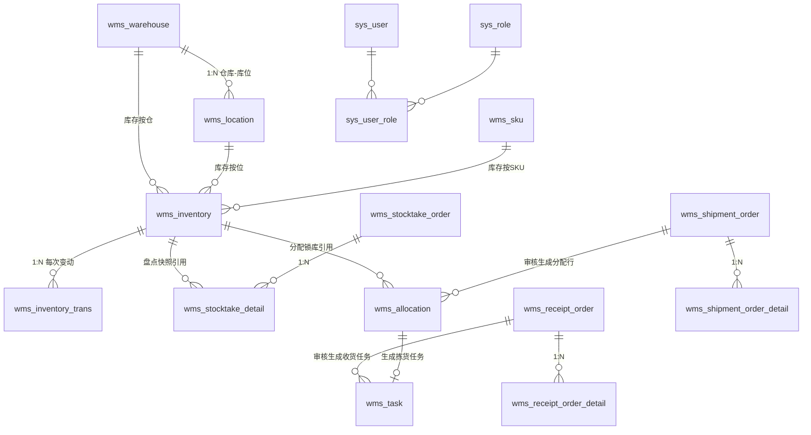

# WMS 数据库设计

> MySQL 8.0.16+（依赖 CHECK 约束强制执行）｜ 全表 InnoDB / utf8mb4
> 生产结构以 `migrations/versions` 中的版本化迁移为准；开发 debug 模式可使用 AutoMigrate。

## 1. 表清单总览（18 张）

| 分组 | 表 | 说明 |
| --- | --- | --- |
| 系统管理 | `sys_user` | 用户（bcrypt 密码） |
| | `sys_role` | 角色（权限串 `perms`） |
| | `sys_user_role` | 用户-角色关联 |
| | `sys_oper_log` | 操作日志（异步写入） |
| 基础数据 | `wms_warehouse` | 仓库 |
| | `wms_location` | 库位（`{库区}-{排}-{列}`） |
| | `wms_sku` | 货品（编码/条码唯一） |
| **库存** | **`wms_inventory`** | **三数量库存行（核心）** |
| | **`wms_inventory_trans`** | **库存流水（对账依据）** |
| 任务 | `wms_task` | 统一任务（收货/上架/拣货） |
| 入库 | `wms_receipt_order` | 入库单 |
| | `wms_receipt_order_detail` | 入库单明细 |
| | `wms_import_task` | Excel 导入任务（状态机） |
| 出库 | `wms_shipment_order` | 出库单（`biz_order_no` 幂等） |
| | `wms_shipment_order_detail` | 出库单明细 |
| | **`wms_allocation`** | **分配明细（锁库行，FIFO 拆批次）** |
| 盘点 | `wms_stocktake_order` | 盘点单 |
| | `wms_stocktake_detail` | 盘点明细（快照/实盘/差异） |

## 2. ER 关系

> 设计要点：`wms_allocation` / `wms_stocktake_detail` 同时保存 `inventory_id` 与**冗余快照字段**（库位编码、批次、货品编码/名称），保证单据历史不受主数据改名/库存行变化影响——WMS 单据"落纸为凭"的行业惯例。

## 3. 核心表结构

### 3.1 wms_inventory（三数量库存行）

| 字段 | 类型 | 说明 |
| --- | --- | --- |
| id | BIGINT | 雪花 ID |
| warehouse_id / location_id / sku_id / batch_no | — | 库存四维定位 |
| **stock_quantity** | INT | 存量 = 可用 + 分配 |
| **available_quantity** | INT | 可用量（可被分配） |
| **allocated_quantity** | INT | 分配量（已锁定待发货） |
| stock_in_time | DATETIME(3) | 首次上架时间，**FIFO 排序依据** |
| created_at / updated_at / deleted_at | — | 审计字段 |

索引与约束：

- `UNIQUE uk_inv (tenant_id, warehouse_id, location_id, sku_id, batch_no)` —— 租户内库存行的业务身份，防重复建行；
- `CHECK chk_inv_non_negative (available_quantity >= 0 AND stock_quantity >= 0)` —— 防超卖**最后兜底**，配合行锁 + 条件更新构成三层防护。

> 注意：MySQL 8.0.16 起 CHECK 约束才真正生效，低版本仅语法兼容不执行。

### 3.2 wms_inventory_trans（库存流水，只增不改）

| 字段 | 说明 |
| --- | --- |
| inventory_id | 关联库存行 |
| trans_type | `RECEIVE / ALLOCATE / SHIP / RELEASE / ADJUST` |
| quantity_change / before_quantity / after_quantity | 存量三段 |
| available_before / available_after | 可用两段（分配类型时与存量变化方向相反） |
| order_no / task_no / operator | 追溯到单据与操作人 |

索引：`inventory_id`（按行查流水）、`trans_type`、`order_no`（按单对账）、`created_at`（时间范围）。

> 正常业务入口将流水与库存变更放在同一事务。分配和释放不改变总库存，`quantity_change=0`，通过可用量前后值反映变化。事务保证同成同败，不能代替业务正确性验证，也不能覆盖人工改库或演示重置。

### 3.3 wms_task（统一任务）

| 字段 | 说明 |
| --- | --- |
| task_no | 任务号（收货 `SH` / 上架 `SJ` / 拣货 `PK` 前缀 + 日期 + 任务 ID），唯一；已有历史格式保留 |
| task_type | `RECEIVE / PUTAWAY / PICK` |
| status | `CREATED → IN_PROGRESS → COMPLETED`（单向） |
| order_id / order_no / detail_id / allocation_id | 来源追溯（拣货任务携带分配行） |
| location_id / location_code / batch_no | 拣货任务的作业位置（来自分配行），拣货员直达库位并按批次核对 |
| target_qty / done_qty | 目标/完成量，支持分次作业 |
| version | 乐观锁，防重复完成 |

### 3.4 wms_allocation（出库分配明细）

| 字段 | 说明 |
| --- | --- |
| order_id / detail_id | 归属出库单与明细行 |
| inventory_id / location_id / batch_no | 锁定的库存行（FIFO 结果） |
| allocated_qty / picked_qty | 分配量 / 已拣量（可分次拣） |
| status | `ALLOCATED → PICKED`（发货后） |
| version | 乐观锁 |

> 为什么必须有独立分配表：一次审核可能跨多个批次/库位，拣货按行执行、取消需按行释放——没有这张表，"释放哪些库存"就有歧义（本项目踩过的坑，见 requirements 6.2 的反面）。

### 3.5 wms_stocktake_detail（盘点明细）

| 字段 | 说明 |
| --- | --- |
| inventory_id | 被盘库存行 |
| book_qty | 创建时快照账面数（不受后续变动影响） |
| actual_qty | 实盘数（NULL=未盘） |
| diff_qty | 差异 = 实盘 − 审核时账面（审核时锁内重算） |
| adjusted | 该明细是否已审核应用；零差异不产生 ADJUST 流水 |

## 4. 全局设计约定

| 约定 | 说明 |
| --- | --- |
| 主键 | 主要业务单据、任务、库存使用雪花 ID；部分系统表由数据库生成主键 |
| 版本号 | 单据进度、任务、分配使用版本条件更新；库存使用行锁和数量条件，递增版本号不等于执行乐观锁校验 |
| 软删除 | `deleted_at DATETIME(3)`；软删记录仍占用唯一键，不能默认认为删除后同编码可重建 |
| 时间 | `DATETIME(3)` 毫秒精度 |
| 单号格式 | 入库 `RK`、出库 `CK`、盘点 `PD` + 日期 + Redis 序号；降级为前缀 + 日期 + F + 32 位 UUID。任务为 `SH/SJ/PK` + 日期 + 任务 ID，不调用 Redis |

单号列现有 `VARCHAR(64)` 可容纳上述格式，无需改写历史单号。单号应作为完整字符串使用，不保证连续，也不宜根据尾部位数推算业务量。雪花 ID 在同一进程内处理时钟回拨和序列耗尽；跨实例需分配不同节点号，跨重启仍依赖时钟不回退及主键约束。

## 5. 与 AutoMigrate 的关系

- 开发/演示环境：启动时 AutoMigrate 建表 + 种子数据（admin/admin123）；
- 生产环境：运行 `cmd/migrate` 执行版本化迁移，应用 release 模式不自动改表。
- AutoMigrate 只保证开发所需的基本表结构，不能替代迁移中的复合索引、历史数据修复和回滚脚本；需要真实压力测试时，数据库应先执行 `cmd/migrate`。

## 6. 导入执行标识（迁移 000006）

`wms_import_task.run_token VARCHAR(36) NOT NULL DEFAULT ''` 标识本次领取。任务状态为 `PENDING / PROCESSING / COMPLETED / FAILED`。领取时写入新 token，心跳、完成、归还和异常恢复均核对 token；建单事务还会锁定任务行并检查执行权。单独比较 `PROCESSING` 状态无法区分旧 worker 和重跑 worker。

生产升级需要先停止旧应用及导入 worker，再执行迁移并启动新应用。旧版本不知道执行标识，不能与新版本同时消费任务。导入文件必须持久化；跨主机部署还需要让消费任务的实例读到同一份文件。本次只在隔离测试库验证了迁移，没有执行线上迁移。

## 7. 多租户索引对齐（迁移 000007）

迁移 000007 只调整索引，不修改业务数据和字段语义。多租户查询的复合索引统一把 `tenant_id` 放在最左侧，覆盖以下高频路径：

- 库存 FIFO、库位/SKU 引用检查；
- 任务按单据、类型、状态推进，以及按仓库、库位、SKU 删除检查；
- 入库、出库、盘点列表的租户 + 仓库 + 状态过滤；
- 单据明细、分配行和盘点明细的租户维度引用检查；
- 库存流水、操作日志和角色删除检查。

`uk_loc_wh_code` 改为 `(tenant_id, warehouse_id, code)`，`uk_user_role` 改为 `(tenant_id, user_id, role_id)`。回滚脚本只恢复旧索引，不删除 `tenant_id` 字段或任何业务数据。

当前没有新增 `stock = available + allocated` 的 MySQL CHECK 约束，因为已有数据的完整性必须先审计；该不变量目前由事务、行锁、条件更新和测试共同保证。
